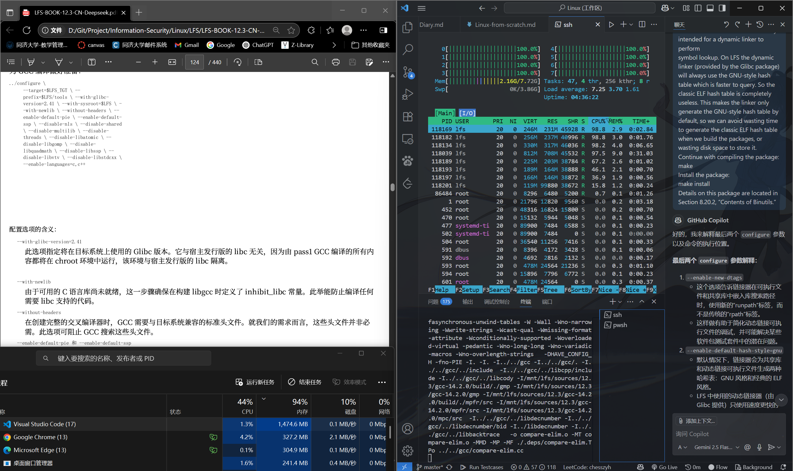
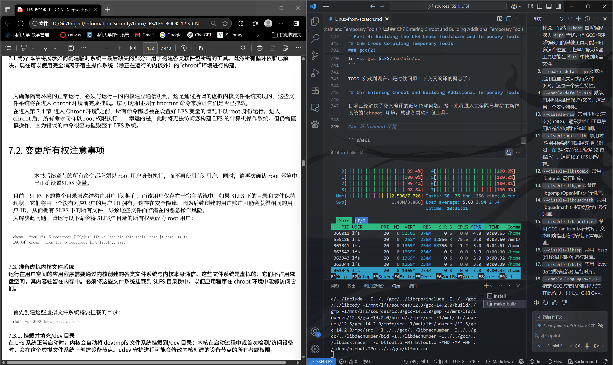

# LFS

- https://zhangjk98.xyz/build-linux-from-scratch/
- [Github](https://github.com/luisgbm/lfs-scripts)

# Part 1: Introduction

## Before Starting

首先遇到了系统的问题。官方推荐4核8G。

- Arch Linux on WSL2：32核16G内存可以拉满，但是WSL2不一定能完全模拟原生Linux，并且瞎折腾有可能还会把Windows宿主机搞坏
- VMWare：目前机器只有2核2G，配置太差结果就是慢。
- Ubuntu PC：4核8G，基本满足需求，但是Ubuntu原生带了很多软件包
- AWS VPS：Debian 12，2核2G内存，同样是配置差

最终决定选择在Ubuntu PC上进行安装。

# Part 2: Preparing for the build

## Ch2 Preparing the Host System

### 2.7 挂载新分区

```shell
# user:root
fdisk /dev/sdb

mkfs.ext4 /dev/sdb1
mkdir -pv /mnt/lfs
mount -v -t ext4 /dev/sdb1 /mnt/lfs

sudo chown root:root /mnt/lfs
sudo chmod 755 /mnt/lfs
```

让分区在系统重启后自动挂载：

```shell
sudo echo "/dev/sdb1   /mnt/lfs   ext4    defaults        1 1" >> /etc/fstab
```

## Ch3 Packages and Patches

```shell
mkdir -v $LFS/source
chmod -v a+wt $LFS/sources  # a+wt："Sticky Bit" 
```

> `chmod`中`a+wt`属于符号模式授权，`[u(user)/g(group)/o(other)/a(all)]`为第一部分Who，`[r/w/x/s(setuid/setgid)/t(sticky)]`为第二部分Permission。`t`：粘滞位，**只能删除或重命名自己拥有的文件**，而不能删除或重命名其他用户的文件，比如`/tmp`目录。

## Ch4 Final Preparations

本章主要是为了构建临时系统做准备。

首先创建一个有限目录层次结构：

```shell
mkdir -pv $LFS/{etc,var} $LFS/usr/{bin,lib,sbin}
for i in bin lib sbin; do
    ln -sv usr/$i $LFS/$i
done
case $(uname -m) in
    x86_64) mkdir -pv $LFS/lib64 ;;
esac

mkdir -pv $LFS/tools
```

添加普通用户`lfs`，并将`$LFS`目录的所有权转移给该用户：

```shell
useradd -s /bin/bash -g lfs -m -k /dev/null lfs
passwd lfs
chown -v lfs $LFS/{usr{,/*},var,etc,tools}
case $(uname -m) in
    x86_64) chown -v lfs $LFS/lib64 ;;
esac
su - lfs    # 启动lfs用户的登录shell
```

为lfs用户创建一个**纯净的工作环境**：

```shell
# file: ~/.bash_profile
exec env -i HOME=$HOME TERM=$TERM PS1='\u:\w\$ ' /bin/bash
```

通过`su - <username>`创建的是**登录shell**，它会首先读取宿主系统全局配置文件`/etc/profile`，然后读取用户的`~/.bash_profile`。通过`/bin/bash`创建的是**非登录shell**，它只会读取用户的`~/.bashrc`。

上面创建的`~/.bash_profile`中命令：`exec`会用后面的命令替换当前正在运行的 shell 进程，`env -i`会清除当前所有环境变量，只保留后面设置的`HOME`、`TERM`和`PS1`，然后执行一个新的 Bash shell(**非登录shell**)。

也就是说，LFS 构建过程强制启动了一个新的、只包含必要的变量（HOME, TERM, PS1）的 shell 环境，可以排除宿主系统可能带来的干扰。

```shell
# file: ~/.bashrc
set +h  # 关闭Bashd的hash功能，以便新工具编译安装后可以立即被bash识别，而不会使用旧的路径缓存
umask 022
LFS=/mnt/lfs
LC_ALL=POSIX
LFS_TGT=$(uname -m)-lfs-linux-gnu
PATH=/usr/bin
if [ ! -L /bin ]; then PATH=/bin:$PATH; fi
PATH=$LFS/tools/bin:$PATH   # 将LFS工具链的路径添加到PATH的最前面
CONFIG_SITE=$LFS/usr/share/config.site
export LFS LC_ALL LFS_TGT PATH CONFIG_SITE

# 可选：为编译启用所有核心
# 注意，-j后必须带数字，否则将导致 make 启动⽆限数量的编译任务，引发系统稳定性问题。
export MAKEFLAGS=-j$(nproc)
```

此外，Arch Linux还存在`/etc/bash.bashrc`文件，根据LFS Book我们需要将其移除：`sudo  [ ! -e /etc/bash.bashrc ] || mv -v /etc/bash.bashrc /etc/bash.bashrc.NOUSE`。

最后，`source ~/.bashrc`来使得修改生效。

---

构建系统时，**效率与正确性**是我们最关心的两个方面。

**构建效率**在本书中使用**SBU（Standard Build Unit）**来衡量，将`Binutils`的第一次编译作为 1 SBU 的基准。`Binutils`是 LFS 构建过程中的第一个软件包，假如`Binutils`的第一次编译耗时 10 分钟，那么 2 SBU 就是 20 分钟。

**正确性检查**，则通过运行软件包的测试套件验证。U5和U6没有必要运行测试套件，因为测试程序本身就是使用刚刚构建的 交叉编译器 编译的。测试套件为LFS环境设计，很可能无法在宿主系统上运行。

运行`binutils`和`gcc`测试套件常见问题是**伪终端(PTYs - Pseudo-Terminals)耗尽**，这可能导致大量测试失败。伪终端是一种软件实现的终端设备对，由**主设备**(终端模拟器，如`xterm`；或者测试套件运行器)和**从设备**(伪终端设备，如`/dev/pts/0`等，表现得像真实终端一样)组成。PTYs耗尽的最可能原因是主机系统未正确设置 `devpts` 文件系统。`devpts` 是一个虚拟文件系统，作用是为伪终端**从设备**动态提供设备文件。

# Part 3: Building the LFS Cross Toolchain and Temporary Tools

## LFS交叉编译实现

- **交叉编译(Cross-compilation)**：在一个计算机系统（**宿主系统** 或 构建系统）上编译代码，但编译生成的可执行文件或库是为 另一个不同类型 的计算机系统（**目标系统**）设计的。
    - 交叉编译的结果不会依赖于宿主系统的库和工具链
- `autoconf`的三元组：`cpu-[vendor]-kernel-os`，如`aarch64-unknown-linux-gnu`可表示运行在64位ARM架构上的Ubuntu系统。其中厂商可省略。
    - 运行软件包的`config.guess`脚本，或者`gcc -dumpmachine`命令可以获取当前系统的三元组。
- **动态链接器**(Dynamic Linker)：负责在程序运行时将所需的共享库加载到内存中，并为程序提供访问这些库的接口。

### `glibc`与`libgcc`：先有鸡还是先有蛋？

- `glibc`：GNU C Library
- `libgcc`：GNU Compiler Collection的运行时库，提供了一些汇编指令集不直接支持的复杂子程序，被交叉编译器`cc1`使用。

- **循环依赖问题**：要构建一个完全功能的 `libgcc`，你需要一个功能完整的 `glibc`。但要构建 `glibc`，你需要一个编译器（包含 `libgcc`）。
- **解决方法**：两级构建
    - 第一阶段：**降级构建**
        - 使用`cc1`构建一个降级的 `libgcc`
        - 使用包含降级`libgcc`的交叉编译器来构建**正常**的 `glibc` 和 **降级**的 `libstdc++`
    - 第二阶段：**正常构建**
        - 使用正常的 `glibc` 构建 **正常**的 `libgcc`
        - 使用正常的 `libgcc` 构建 **正常**的 `libstdc++`

### 其他构建说明

**安装顺序**：

- `binutils`
    - 提供了基本的二进制工具，如汇编器、链接器等。
- `gcc`
- `linux-api-headers`：
    - 提供了内核 API 的头文件，供用户空间程序使用。
- `glibc`
- ...

## Ch5 Compiling a Cross-Toolchain

### binutils

```shell
# You're now in binutils's directory
mkdir -v build
cd build
../configure --prefix=$LFS/tools \
             --with-sysroot=$LFS \
             --target=$LFS_TGT   \
             --disable-nls       \
             --enable-gprofng=no \
             --disable-werror    \
             --enable-new-dtags  \
             --enable-default-hash-style=gnu
make
make install
```

### gcc

```shell
# You're now in gcc's directory
tar -xf ../mpfr-*.tar.xz
mv -v mpfr-* mpfr
tar -xf ../gmp-*.tar.xz
mv -v gmp-* gmp
tar -xf ../mpc-*.tar.gz
mv -v mpc-* mpc

# x86_64架构：将`lib64`目录链接到`lib`目录
case $(uname -m) in
x86_64)
sed -e '/m64=/s/lib64/lib/' \
    -i.orig gcc/config/i386/t-linux64
;;
esac

mkdir -v build
cd build    

 ../configure                  \
    --target=$LFS_TGT         \
    --prefix=$LFS/tools       \
    --with-glibc-version=2.41 \
    --with-sysroot=$LFS       \
    --with-newlib             \
    --without-headers         \
    --enable-default-pie      \
    --enable-default-ssp      \
    --disable-nls             \
    --disable-shared          \
    --disable-multilib        \
    --disable-threads         \
    --disable-libatomic       \
    --disable-libgomp         \
    --disable-libquadmath     \
    --disable-libssp          \
    --disable-libvtv          \
    --disable-libstdcxx       \
    --enable-languages=c,c++

make
# real    9m46.283s
# user    53m25.940s
# sys     4m1.720s

make install
```

编译GCC的过程：

!!!NOTE 第一次编译时，我遗漏了以下命令，导致在Ch6 `bash`和`coreutils`编译时开始出现错误：

```shell
cd ..
cat gcc/limitx.h gcc/glimits.h gcc/limity.h > \
`dirname $($LFS_TGT-gcc -print-libgcc-file-name)`/include/limits.h
```

具体解读参考[Ch6 Coreutils](#coreutils)

### linux-api-headers

```shell
# You're now in linux-api-headers's directory

# 彻底清理内核源代码树，移除所有配置、编译文件等
make mrproper
# 从内核源代码树中提取用户空间程序头文件，暂时放到./usr/include目录下
make headers
# 删除./usr/include目录下的非头文件
# !!!NOTE 第一次对着敲命令时，敲成/usr/include了！还好lfs只是普通用户，所有删除尝试都被拒绝了 
# 这也说明了：
# 1. 不要以root身份在系统里乱搞是对的
# 2. 敲命令前先理解命令的含义
find usr/include -type f ! -name '*.h' -delete
# 将提取并清理好的内核头文件从临时位置 ./usr/include 复制到 LFS 目标文件系统的 /usr/include 目录中
cp -rv usr/include $LFS/usr
```

### glibc

```shell
# You're now in glibc's directory

# 为动态链接器创建兼容性符号链接(Linux Standard Base)
case $(uname -m) in
i?86) ln -sfv ld-linux.so.2 $LFS/lib/ld-lsb.so.3
;;
x86_64) ln -sfv ../lib/ld-linux-x86-64.so.2 $LFS/lib64
ln -sfv ../lib/ld-linux-x86-64.so.2 $LFS/lib64/ld-lsb-x86-64.so.3
;;
esac

# 应用补丁，让 Glibc 的一些程序将运行时数据存储在 FHS (Filesystem Hierarchy Standard) 标准兼容的位置，而不是非标准的 /var/db 目录
patch -Np1 -i ../glibc-2.41-fhs-1.patch

mkdir -v build
cd build

echo "rootsbindir=/usr/sbin" > configparms

../configure \
--prefix=/usr \
--host=$LFS_TGT \
--build=$(../scripts/config.guess) \
--enable-kernel=5.4 \
--with-headers=$LFS/usr/include \
--disable-nscd \
libc_cv_slibdir=/usr/lib

make
# real    3m7.375s
# user    14m51.126s
# sys     3m47.616s

make DESTDIR=$LFS install

# 修复ldd脚本中的路径问题
sed '/RTLDLIST=/s@/usr@@g' -i $LFS/usr/bin/ldd
```

此时必须暂停进一步安装，检查新工具链基本功能(编译、链接)是否正常。

```shell
echo 'int main(){}' | $LFS_TGT-gcc -xc -
readelf -l a.out | grep ld-linux
# 结果应该是：
#   [Requesting program interpreter: /tools/lib/ld-linux-x86-64.so.2]
```

### libstdc++

```shell
# You're now in **gcc's** directory
cd build
../libstdc++-v3/configure \
--host=$LFS_TGT \
--build=$(../config.guess) \
--prefix=/usr \
--disable-multilib \
--disable-nls \
--disable-libstdcxx-pch \
--with-gxx-include-dir=/tools/$LFS_TGT/include/c++/14.2.0

make
# real    0m32.036s
# user    1m34.259s
# sys     0m22.430s

make DESTDIR=$LFS install

# 删除libtool archive文件
# .la 文件是 libtool 生成的库归档文件。它们包含关于库是如何构建的、它的依赖关系以及链接时需要的信息
# 交叉编译时，.la 文件可能包含构建系统的路径信息和配置细节，导致后续编译或链接时出现问题
rm -v $LFS/usr/lib/lib{stdc++{,exp,fs},supc++}.la
```

## Ch6 Cross Compiling Temporary Tools

使用刚刚构建的交叉工具链来编译临时工具。本章编译的临时工具包括：

- [m4](https://www.gnu.org/software/m4/)
- [ncurses](https://invisible-island.net/ncurses/)

### m4

m4 是一个宏处理器，通常用于生成代码或配置文件。

```shell
# You're now in m4-1.4.19's directory
./configure --prefix=/usr   \
        --host=$LFS_TGT \
        --build=$(build-aux/config.guess)

make

# real    0m1.121s
# user    0m2.514s
# sys     0m0.769s
make DESTDIR=$LFS install
```

### ncurses

ncurses 是一个终端处理库，提供了对终端的控制和文本界面支持。

```shell
# You're now in ncurses's directory
mkdir -v build

pushd build
    ../configure AWK=gawk
    make -C include
    make -C progs tic
popd

./configure --prefix=/usr            \
        --host=$LFS_TGT              \
        --build=$(./config.guess)    \
        --mandir=/usr/share/man      \
        --with-manpage-format=normal \
        --with-shared                \
        --without-normal             \
        --with-cxx-shared            \
        --without-debug              \
        --without-ada                \
        --disable-stripping          \
        AWK=gawk

make
# real    0m28.219s
# user    1m48.435s
# sys     0m13.910s

make DESTDIR=$LFS TIC_PATH=$(pwd)/build/progs/tic install
ln -sv libncursesw.so $LFS/usr/lib/libncurses.so
sed -e 's/^#if.*XOPEN.*$/#if 1/' \
-i $LFS/usr/include/curses.h    # 修改curses.h，确保Ncurses总是选择与我们的libncursesw.so兼容的宽字符版本，而不是与libncurses.so兼容的8位字符版本
```

### bash-5.3.1-rc1(TODO)

```shell
# You're now in bash's directory

# --without-bash-malloc: 禁用bash的内存分配功能，防止段错误
./configure --prefix=/usr                      \
            --build=$(sh support/config.guess) \
            --host=$LFS_TGT                    \
            --without-bash-malloc

make # 我在这步遇到了接二连三的问题，解决之后仍然有疑点
```

我在这步遇到了报错，输出如下：

```shell
mkbuiltins.c:267:29: error: too many arguments to function 'xmalloc'; expected 0, have 1
  267 |           error_directory = xmalloc (2 + strlen (argv[arg_index]));
      |                             ^~~~~~~  ~~~~~~~~~~~~~~~~~~~~~~~~~~~~
mkbuiltins.c:62:14: note: declared here
   62 | static char *xmalloc (), *xrealloc ();
      |              ^~~~~~~
```

在 `mkbuiltins.c` 文件中，许多函数（如 `xmalloc`, `file_error` 等）使用了旧式的 C 语言函数声明，例如 `static char *xmalloc ()`。我使用的Arch Linux因为滚动更新，`gcc`版本较新(15.1.1)，看到老式声明时认为函数应接受0个参数。所以当 `xmalloc` 被带参调用时抛出一堆报错。

我没有在LFS-12.3官方的补丁包里看到`bash-5.2.37`的补丁，但在`12.1`找到了一个`5.2.21`的补丁(检查发现与本问题无关)。一个2025年5月的[Reddit帖子](https://www.reddit.com/r/linuxfromscratch/comments/1kfc6jn/bash_failing_compile_in_multilib_123/)也有人遇到同样问题，有评论者提到将 Arch Linux 上的 GCC 从 15.x 降级到 14.2，或者使用`bash-5.3-rc1`版本可以解决。或者，你也可以根据海量报错信息，手动修改 `mkbuiltins.c` 中的函数声明，但我懒得弄了。

我选择使用最新版`bash-5.3-rc1`(可通过`curl -O https://ftp.gnu.org/gnu/bash/bash-5.3-rc1.tar.gz`下载)和与之前相同的配置，但直接编译依然报错如下：

```shell
In file included from mkbuiltins.c:50:
../bashansi.h:44:23: error: 'bool' cannot be defined via 'typedef'
44 | typedef unsigned char bool;
| ^~~~
../bashansi.h:44:23: note: 'bool' is a keyword with '-std=c23' onwards
../bashansi.h:44:1: warning: useless type name in empty declaration
44 | typedef unsigned char bool;
```

检查`bashansi.h`，发现有一段检查`bool`类型的代码：

```h
/* If bool is not a compiler builtin, prefer stdbool.h if we have it */

#if !defined (HAVE_C_BOOL)
#  if defined (HAVE_STDBOOL_H)
#    include <stdbool.h>
#  else
#    undef bool
typedef unsigned char bool;     // 注意，这句也包含在`#else`分支中
#    define true 1
#    define false 0
#  endif
```

含义很简单：如果没有定义`HAVE_C_BOOL`，即编译器不支持`_Bool`类型，则通过`HAVE_STDBOOL_H`检查`stdbool.h`头文件是否可用，可用则包含，否则先`undef`掉`bool`(防止与之前可能的定义冲突)，再手动定义`bool`类型(`typedef unsigned char bool` + `define`)：`true`为`1`，`false`为`0`。

但是，注意`typedef unsigned char bool;`这一行。根据上面的报错，`error: 'bool' cannot be defined via 'typedef'`，如果能成功`#include <stdbool.h>`，则不会重定义`bool`；能报这个错，只可能说明预处理器分支走向了`else`分支，即`HAVE_STDBOOL_H`为`0`。但是我检查`./config.h`，发现确实有`#define HAVE_STDBOOL_H 1`。这真是见鬼了……

暂时搞不清楚了，目前的解决方法是：

1. 完全注释掉`bashansi.h`整段`bool`判断逻辑
2. 在`mkbuiltins.c`第一行显式添加声明`#include <stdbool.h>`

然后就编译成功了。

```shell
# Continue with the rest of the bash build
make DESTDIR=$LFS install

# rm -v $LFS/usr/bin/sh # 如果有，删除原有的sh链接
ln -sv bash $LFS/usr/bin/sh
```

### coreutils

```shell
# You're now in coreutils's directory
./configure --prefix=/usr                     \
            --host=$LFS_TGT                   \
            --build=$(build-aux/config.guess) \
            --enable-install-program=hostname \
            --enable-no-install-program=kill,uptime

make
```

执行到这里时，终于开始出现第一个`Error`了：

> /mnt/lfs/usr/include/bits/stdlib.h:98:3: error: #error "Assumed value of MB_LEN_MAX wrong".

阅读[FAQ](https://www.linuxfromscratch.org/lfs/faq.html#m4-mb-len-max-wrong)，错误原因为：在构建临时工具链时，GCC 的头文件 (`limits.h`) 没有正确地包含或同步 Glibc 的相关信息，导致 `MB_LEN_MAX` 的值不正确。但后续我发现FAQ的问题和我遇到的问题并不太一样，排查之后发现是在Ch5编译`gcc`时遗漏了`cat ... > .../include/limits.h`命令。

GCC 第一遍构建安装了一个内部的 `limits.h`，但它是一个部分文件，因为它在构建时 `$LFS/usr/include/limits.h` 尚不存在。这个部分文件足以用于构建 `Glibc`。但是，后续阶段(也就是现在)需要一个完整的内部头文件，而 `cat ... > .../include/limits.h` 命令就是用来创建这个完整版本的内部 `limits.h` 文件的。

更新`limits.h`文件后重新编译`coreutils`，这回没有任何报错了。

```shell
make
make DESTDIR=$LFS install

mv -v $LFS/usr/bin/chroot              $LFS/usr/sbin
mkdir -pv $LFS/usr/share/man/man8
mv -v $LFS/usr/share/man/man1/chroot.1 $LFS/usr/share/man/man8/chroot.8
sed -i 's/"1"/"8"/'                    $LFS/usr/share/man/man8/chroot.8
```

### diffutils

diffutils 是一个用于比较文件或目录差异的工具集。

```shell
./configure --prefix=/usr   \
            --host=$LFS_TGT \
            --build=$(./build-aux/config.guess)

make

make DESTDIR=$LFS install
```

### file

`file` 是一个用于识别文件类型的工具。注意，`file`使用“魔术”签名文件（magic signature file，比如`/usr/share/misc/magic.mgc`）来识别文件类型，它在构建自身的过程中就需要处理和编译其**自身**的“魔术”签名文件，因此需要确保宿主系统的`file`工具版本与正在构建的版本兼容(想通)。

```shell
mkdir build
pushd build
../configure --disable-bzlib      \
            --disable-libseccomp \
            --disable-xzlib      \
            --disable-zlib
make
popd

# Prepare File for compilation:
./configure --prefix=/usr --host=$LFS_TGT --build=$(./config.guess)
# Compile the package:
make FILE_COMPILE=$(pwd)/build/src/file
# Install the package:
make DESTDIR=$LFS install
# Remove the libtool archive file because it is harmful for cross compilation:
rm -v $LFS/usr/lib/libmagic.la
```

### findutils

findutils 是一个用于查找文件和目录的工具集。支持创建、维
护及查询文件数据库（通常比递归查找更快，但若数据库未及时更新则可能不可靠）。

```shell
./configure --prefix=/usr                   \
            --localstatedir=/var/lib/locate \
            --host=$LFS_TGT                 \
            --build=$(build-aux/config.guess)
make
make DESTDIR=$LFS install
```

### gawk

`gawk` 是 GNU 的 AWK 实现，是一个强大的文本处理工具。

```shell
# 删除Makefile.in中的`extras`，表示不需要额外的功能
# 这一步，和我后续的一个奇怪问题有关，不过这不是LFS Book的错误
sed -i 's/extras//' Makefile.in

./configure --prefix=/usr   \
        --host=$LFS_TGT \
        --build=$(build-aux/config.guess)
make
make DESTDIR=$LFS install   
```

这一步，尽管我完全是按照LFS Book操作的，但仍然出现错误：

```shell
./support/pma.h:66:38: error: unknown type name 'size_t'
   66 | extern void * pma_realloc(void *ptr, size_t size);
      |                                      ^~~~~~
./support/pma.h:66:38: note: 'size_t' is defined in header '<stddef.h>'; this is probably fixable by adding '#include <stddef.h>'
```

这应该是`gawk-5.3.1`的一个已知问题，找到gawk目录下`support/pma.h`，在开头加入`#include <stddef.h>`，如下所示：

```c
#ifndef PMA_H_INCLUDED
#define PMA_H_INCLUDED

// ADD THIS LINE
#include <stddef.h>  // for size_t

// version strings of interface and implementation should match
#define PMA_H_VERSION "2022.10Oct.30.1667172241 (Avon 8-g1)"
extern const char pma_version[];
```

但是，加入之后、`make clean`、`make`依然报错，编译器依然找不到`size_t`，还“贴心”地在我新加的`#include <stddef.h>`下一行再次提示我：

```shell
./support/pma.h:26:1: note: 'size_t' is defined in header '<stddef.h>'; this is probably fixable by adding '#include <stddef.h>'
   25 | #include <stddef.h>  // for size_t
  +++ |+#include <stddef.h>
   26 | 
```

这就见鬼了！我确定`stddef.h`是存在的并且能被编译器发现。所以我重新读了`make`的完整输出，发现`version.c`似乎出了明显问题。`version.c`通常是一个自动生成的文件，包含了软件包的版本信息。

```shell
# make的命令行输出，不是make log
version.c:1:5: error: expected '=', ',', ';', 'asm' or '__attribute__' before '-' token
    1 | sed -i 's/extras//' Makefile.in
      |     ^
version.c:1:8: warning: multi-character literal with 10 characters exceeds 'int' size of 4 bytes
    1 | sed -i 's/extras//' Makefile.in
      |        ^~~~~~~~~~~~
```

LFS Book的`sed -i 's/extras//' Makefile.in`命令，不知道为什么被放到了`version.c`的第一行，导致了后续连锁反应：即使是系统头文件（`stdlib.h`）中的 `size_t` 类型也无法被识别，最后错误蔓延到 `pma.h`。

最终解决：

1. 在`support/pma.h`中添加`#include <stddef.h>`，确保 `size_t` 被正确识别。
2. 删除`version.c`文件意外加入的 `sed` 行内容，然后重新编译。这次没有问题了。

这也给了我几个启示：

1. 在编译过程中，仔细阅读 `make` 的输出非常重要，尤其是错误和警告信息。
2. 编译器出现莫名其妙反常问题时，检查配置问题而不是代码本身。
3. 保留原始的软件包，确保可以随时`rm -rf <package>`再`tar -xf <package>`重新开始。

### grep

`grep` 是一个用于搜索文本的工具，支持正则表达式。

```shell
 ./configure --prefix=/usr   \
            --host=$LFS_TGT \
            --build=$(./build-aux/config.guess)

make
make DESTDIR=$LFS install
```

### gzip

`gzip` 是一个用于压缩和解压缩文件的工具。

```shell
./configure --prefix=/usr --host=$LFS_TGT
make
make DESTDIR=$LFS install
```

### make

`make` 是一个自动化构建工具，用于根据 Makefile 中的规则编译和链接程序。

```shell
 ./configure --prefix=/usr   \
            --without-guile \
            --host=$LFS_TGT \
            --build=$(build-aux/config.guess)
make
make DESTDIR=$LFS install
```

### patch

`patch` 是一个用于应用补丁文件的工具。

```shell
 ./configure --prefix=/usr   \
            --host=$LFS_TGT \
            --build=$(build-aux/config.guess)
make
make DESTDIR=$LFS install
```

### sed

`sed` 是一个流编辑器，用于对文本进行基本的转换和处理。

```shell
 ./configure --prefix=/usr   \
            --host=$LFS_TGT \
            --build=$(./build-aux/config.guess)
make
make DESTDIR=$LFS install
```

### tar

`tar` 是一个用于打包和解包文件的工具。

```shell
 ./configure --prefix=/usr                     \
            --host=$LFS_TGT                   \
            --build=$(build-aux/config.guess)
make
make DESTDIR=$LFS install
```

### xz

`xz` 是一个用于压缩和解压缩文件的工具，通常比 `gzip` 提供更好的压缩率。

```shell
./configure --prefix=/usr                     \
            --host=$LFS_TGT                   \
            --build=$(build-aux/config.guess) \
            --disable-static                  \
            --docdir=/usr/share/doc/xz-5.6.4
make
make DESTDIR=$LFS install
rm -v $LFS/usr/lib/liblzma.la
```

### binutils(2)

这是第二次编译 `binutils`。

```shell
sed '6031s/$add_dir//' -i ltmain.sh

# 删除第一次的编译目录，否则会报错
rm -rf build
mkdir -v build
cd build

../configure                   \
    --prefix=/usr              \
    --build=$(../config.guess) \
    --host=$LFS_TGT            \
    --disable-nls              \
    --enable-shared            \
    --enable-gprofng=no        \
    --disable-werror           \
    --enable-64-bit-bfd        \
    --enable-new-dtags         \
    --enable-default-hash-style=gnu

make
make DESTDIR=$LFS install

```

### gcc(2)

```shell
case $(uname -m) in
x86_64)
sed -e '/m64=/s/lib64/lib/' \
    -i.orig gcc/config/i386/t-linux64
;;
esac

sed '/thread_header =/s/@.*@/gthr-posix.h/' \
-i libgcc/Makefile.in libstdc++-v3/include/Makefile.in

rm -rf build
mkdir -v build
cd build

 ../configure                                       \
    --build=$(../config.guess)                     \
    --host=$LFS_TGT                                \
    --target=$LFS_TGT                              \
    LDFLAGS_FOR_TARGET=-L$PWD/$LFS_TGT/libgcc      \
    --prefix=/usr                                  \
    --with-build-sysroot=$LFS                      \
    --enable-default-pie                           \
    --enable-default-ssp                           \
    --disable-nls                                  \
    --disable-multilib                             \
    --disable-libatomic                            \
    --disable-libgomp                              \
    --disable-libquadmath                          \
    --disable-libsanitizer                         \
    --disable-libssp                               \
    --disable-libvtv                               \
    --enable-languages=c,c++

make
make DESTDIR=$LFS install
ln -sv gcc $LFS/usr/bin/cc
```

TODO 实践到现在，是时候回顾一下交叉编译的概念了！



## Ch7 Entering Chroot and Building Additional Temporary Tools

目前已经解决了交叉编译的循环依赖问题，接下来将进入完全隔离与宿主操作系统的`chroot`环境，构建各类软件包工具。

大概看了一下，应该还有很长一段路要走，现在估计也就刚到30%吧。

**第7章所有命令均需要以`root`用户身份执行。**

首先，将`$LFS`所有权转移到`root`用户。因为当前`lfs`用户仅存在于宿主系统中，`$LFS`下文件由一个没有对应账户的用户ID拥有。如果后续创建的账户获得了相同的ID，则会意外拥有`$LFS`下的所有文件的所有权。

```shell
# mkdir $LFS/tools # 选做，我这里发现没有这个文件夹
 chown --from lfs -R root:root $LFS/{usr,lib,var,etc,bin,sbin,tools}
 case $(uname -m) in
  x86_64) chown --from lfs -R root:root $LFS/lib64 ;;
 esac
```

准备虚拟内核文件系统。用户态应用通过**虚拟文件系统**和内核通信，该系统完全运行在内存中，因此在`chroot`下想要访问，就必须挂载到`$LFS`目录下。

```shell
 mkdir -pv $LFS/{dev,proc,sys,run}
# 准备/dev目录
mount -v --bind /dev $LFS/dev   # 绑定挂载
```

此处**绑定挂载**指的是让`$LFS/dev`成为`/dev`的别名，二者是同一目录的不同入口。**绑定挂载**与**普通挂载**的区别在于，普通挂载是将一个新的文件系统(如U盘`sdb1`、新硬盘分区`sda1`)挂载到另一个文件系统上，而绑定挂载则是将一个已存在的目录(如`/dev`)挂载到另一个目录(如`$LFS/dev`)上。

接下来挂载剩余的虚拟文件系统：

```shell
mount -vt devpts devpts -o gid=5,mode=0620 $LFS/dev/pts
mount -vt proc proc $LFS/proc
mount -vt sysfs sysfs $LFS/sys
mount -vt tmpfs tmpfs $LFS/run

# 确保/dev/shm能在`chroot`环境中使用
 if [ -h $LFS/dev/shm ]; then
  install -v -d -m 1777 $LFS$(realpath /dev/shm)
 else
  mount -vt tmpfs -o nosuid,nodev tmpfs $LFS/dev/shm
 fi
```

你可能会有疑问(或者我有，因为我菜)：为什么只有`/dev`目录需要绑定挂载，而其他目录都直接挂载？

这是因为，我们需要用宿主机提供的硬件设备服务(`/dev`)来创建一个新的文件系统实例(`/proc`等)。`/dev`包含了所有与**硬件**通信所需的设备文件，由宿主机内核动态创建和管理。绑定挂载能够让`chroot`模拟在宿主机上运行的环境。而其他目录如`/proc`，我们需要的不是共享宿主机的现有目录，所以需要创建新的虚拟文件系统实例。

接下来，以root身份进入`chroot`环境：

```shell
 chroot "$LFS" /usr/bin/env -i   \
    HOME=/root                  \
    TERM="$TERM"                \
    PS1='(lfs chroot) \u:\w\$ ' \
    PATH=/usr/bin:/usr/sbin     \
    MAKEFLAGS="-j$(nproc)"      \
    TESTSUITEFLAGS="-j$(nproc)" \
    /bin/bash --login
```

到此，不再需要使用`$LFS`变量，所有操作都在`chroot`环境中进行。并且`/tools/bin`也不在`$PATH`中，意味着交叉工具链将不再被使用。如果意外退出了`chroot`环境，我们必须重新挂载虚拟文件系统，再重新进入`chroot`。

> 执行之后bash显示：`(lfs chroot) I have no name!:/# `(因为`/etc/passwd`尚未创建)，这句感觉有点莫名可爱呢

继续创建目录结构、必要文件和符号链接：

```shell
# 创建目录结构
mkdir -pv /{boot,home,mnt,opt,srv}
mkdir -pv /etc/{opt,sysconfig}
mkdir -pv /lib/firmware
mkdir -pv /media/{floppy,cdrom}
mkdir -pv /usr/{,local/}{include,src}
mkdir -pv /usr/lib/locale
mkdir -pv /usr/local/{bin,lib,sbin}
mkdir -pv /usr/{,local/}share/{color,dict,doc,info,locale,man}
mkdir -pv /usr/{,local/}share/{misc,terminfo,zoneinfo}
mkdir -pv /usr/{,local/}share/man/man{1..8}
mkdir -pv /var/{cache,local,log,mail,opt,spool}
mkdir -pv /var/lib/{color,misc,locate}
ln -sfv /run /var/run
ln -sfv /run/lock /var/lock
install -dv -m 0750 /root
install -dv -m 1777 /tmp /var/tmp

# 创建符号链接、必要文件
ln -sv /proc/self/mounts /etc/mtab
cat > /etc/hosts << EOF
127.0.0.1  localhost $(hostname)
::1        localhost
EOF

# 创建`/etc/passwd`文件，确保root用户可以登录并被系统识别
cat > /etc/passwd << "EOF"
root:x:0:0:root:/root:/bin/bash
bin:x:1:1:bin:/dev/null:/usr/bin/false
daemon:x:6:6:Daemon User:/dev/null:/usr/bin/false
messagebus:x:18:18:D-Bus Message Daemon User:/run/dbus:/usr/bin/false
uuidd:x:80:80:UUID Generation Daemon User:/dev/null:/usr/bin/false
nobody:x:65534:65534:Unprivileged User:/dev/null:/usr/bin/false
EOF

# 创建`/etc/group`
# Linux 标准规范仅仅建议 GID: 1->root, 2->bin, 5->tty or devpts
# 而其他组名可以由管理员灵活设置
# 编写良好的程序应该使用组名而不是组ID来访问组权限，如果有问题，不是管理员的锅

cat > /etc/group << "EOF"
root:x:0:
bin:x:1:daemon
sys:x:2:
kmem:x:3:
tape:x:4:
tty:x:5:
daemon:x:6:
floppy:x:7:
disk:x:8:
lp:x:9:
dialout:x:10:
audio:x:11:
video:x:12:
utmp:x:13:
cdrom:x:15:
adm:x:16:
messagebus:x:18:
input:x:24:
mail:x:34:
kvm:x:61:
uuidd:x:80:
wheel:x:97:
users:x:999:
nogroup:x:65534:
EOF

# 添加Ch8需要的普通用户
echo "tester:x:101:101::/home/tester:/bin/bash" >> /etc/passwd
echo "tester:x:101:" >> /etc/group
install -o tester -d /home/tester

# 消除`I have no name!`的提示
exec /usr/bin/bash --login

# 初始化日志文件(如果文件不存在，程序不会自动创建)并设置适当权限
# wtmp: 所有登录和注销记录
# lastlog: 记录每个用户的最后登录时间
# faillog: 记录登录失败的尝试
# btmp: 记录不良的登录尝试

touch /var/log/{btmp,lastlog,faillog,wtmp}
chgrp -v utmp /var/log/lastlog
chmod -v 664  /var/log/lastlog
chmod -v 600  /var/log/btmp
```

接下来，安装其他软件包。

### gettext

`gettext`是一个用于国际化和本地化的工具集，允许程序编译时启动`NLS`(National Language Support)，以用户的语言显示信息。

```shell
# You're now in chroot's gettext directory
./configure --disable-shared
make
cp -v gettext-tools/src/{msgfmt,msgmerge,xgettext} /usr/bin
```

### bison

`bison` 是一个 GNU 的解析器生成器，用于将语法规则转换为可执行的解析器代码。

```shell
./configure --prefix=/usr \
            --docdir=/usr/share/doc/bison-3.8.2
```

这里第一次出现配置报错：

```shell
checking for GNU M4 that supports accurate traces... configure: error: no acceptable m4 could be found in $PATH.
GNU M4 1.4.6 or later is required; 1.4.16 or newer is recommended.
GNU M4 1.4.15 uses a buggy replacement strstr on some systems.
Glibc 2.9 - 2.12 and GNU M4 1.4.11 - 1.4.15 have another strstr bug.
```

在软件包的构建过程中，顺序是非常重要的。`bison` 需要 `m4` 来处理宏和预处理指令，但在构建过程中，`m4` 还没有被安装，LFS Book也没有 `m4` 的章节(BUG?)。我们先手动安装：

```shell
# You're now in m4's directory
./configure --prefix=/usr
make
make install
```

再回到 `bison` 的目录，重新配置、编译安装即可。

### perl

`perl` 是一个强大的脚本语言，广泛用于文本处理、系统管理和网络编程。

> `wget https://www.cpan.org/src/5.0/perl-5.40.2.tar.gz`(?)

```shell
sh Configure -des                                        \
            -D prefix=/usr                               \
            -D vendorprefix=/usr                         \
            -D useshrplib                                \
            -D privlib=/usr/lib/perl5/5.40/core_perl     \
            -D archlib=/usr/lib/perl5/5.40/core_perl     \
            -D sitelib=/usr/lib/perl5/5.40/site_perl     \
            -D sitearch=/usr/lib/perl5/5.40/site_perl    \
            -D vendorlib=/usr/lib/perl5/5.40/vendor_perl \
            -D vendorarch=/usr/lib/perl5/5.40/vendor_perl
make
make install
```

### python

当前无需安装静态库和包管理工具`pip`。

> `wget https://www.python.org/ftp/python/3.13.2/Python-3.13.2.tar.xz`(?)

```shell
./configure --prefix=/usr   \
        --enable-shared \
        --without-ensurepip
make
make install
```

### texinfo

`texinfo` 是一个用于创建和维护文档的工具，支持生成多种格式的文档。

```shell
./configure --prefix=/usr
make
make install
```

### util-linux

`util-linux` 是一组实用工具的集合，提供了许多系统管理和维护功能。

```shell
mkdir -pv /var/lib/hwclock
./configure --libdir=/usr/lib \
        --runstatedir=/run    \
        --disable-chfn-chsh   \
        --disable-login       \
        --disable-nologin     \
        --disable-su          \
        --disable-setpriv     \
        --disable-runuser     \
        --disable-pylibmount  \
        --disable-static      \
        --disable-liblastlog2 \
        --without-python      \
        ADJTIME_PATH=/var/lib/hwclock/adjtime \
        --docdir=/usr/share/doc/util-linux-2.40.4
make
make install   
```

### 清理并保存临时系统

```shell
rm -rf /usr/share/{info,man,doc}/*
find /usr/{lib,libexec} -name \*.la -delete
rm -rf /tools
```

此处可以进行备份，直接拍快照或者按照LFS Book进行打包。

# Part 4: Building the LFS System

## Ch8 Installing Basic System Software

