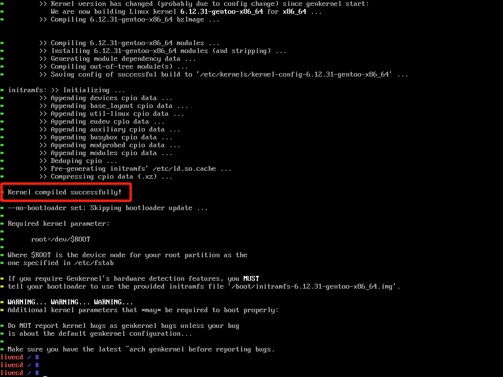
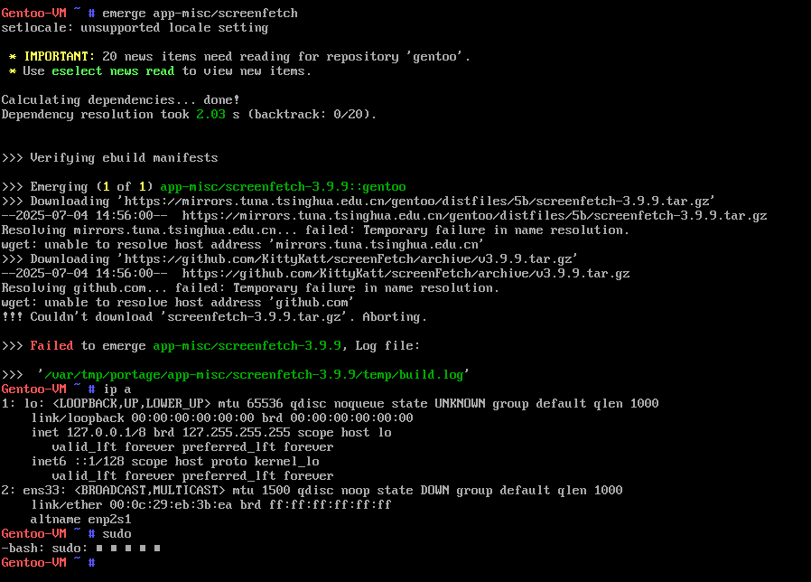
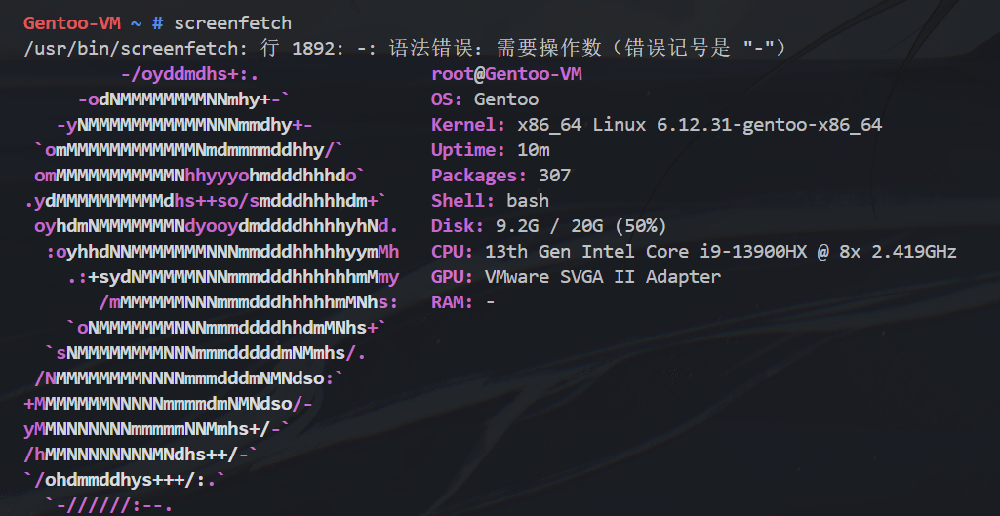
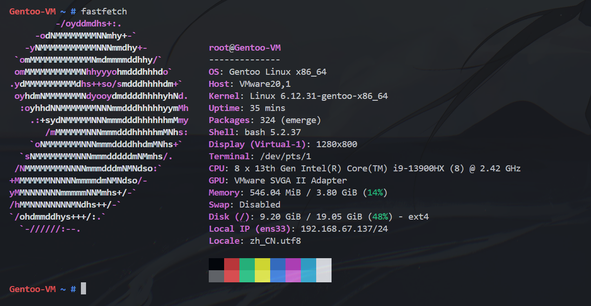

# Gentoo OS虚拟机安装

- 官方文档：https://wiki.gentoo.org/wiki/VMware
    - 纯英文，我不太想看，所以参考了中文教程
- 主要参考教程：https://segmentfault.com/a/1190000021830333
    - 写的非常好。本文就是参考这篇教程。
    - 总共耗时5h左右。

## 准备工作

下载Gentoo-minimal安装镜像，创建VMWare虚拟机，启动方式**UEFI**，硬盘建议至少20GB，更大更保险。我最初设置的是2核2G，发现实在是太慢了，后来改成了8核3G(不知道为什么内存加不上去，我也不敢贸然关闭虚拟机，中断都是通过挂起实现的)。所以尽可能高配置比较好，节省等待编译的时间。

```shell
# 设置root密码
passwd
# 设置远程可root登录
sed -i 's/#PermitRootLogin prohibit-password/PermitRootLogin yes/' /etc/ssh/sshd_config
# 开启ssh
rc-service sshd start
```

## 安装Stage3文件

首先进行磁盘分区。

```shell
parted /dev/sda mklabel gpt
parted /dev/sda mkpart efi fat32 0% 512M
parted /dev/sda mkpart root ext4 512M 100%
parted /dev/sda set 1 esp on

# 格式化分区
mkfs.fat -F32 /dev/sda1
mkfs.ext4 /dev/sda2
mount /dev/sda2 /mnt/gentoo
```

然后安装Stage3。

Gentoo的包主要分为Stage1-4，其中：

1. Stage1：源代码包
2. Stage2：二进制包(Stage1代码+Stage1编译出来的文件)
3. Stage3：包含系统基础组件，但不包含内核和引导器
4. Stage4：包含Stage3和内核、引导器等

我们选择Stage3，去[清华开源镜像站](https://mirrors.tuna.tsinghua.edu.cn/gentoo/releases/amd64/autobuilds/current-stage3-amd64-openrc/stage3-amd64-openrc-20250702T205201Z.tar.xz)下载最新的Stage3 `tar.gz`文件。包有两种初始化方式：`openrc`和`systemd`，`systemd`是大多数其他Linux系统使用的init系统，但 Gentoo Handbook 的标准流程使用`openrc`版本，因此我们采用openrc。

```shell
cd /mnt/gentoo
wget https://mirrors.tuna.tsinghua.edu.cn/gentoo/releases/amd64/autobuilds/current-stage3-amd64-openrc/stage3-amd64-openrc-20250702T205201Z.tar.xz # 或者使用文本浏览器link: `links https://mirrors.tuna.tsinghua.edu.cn/gentoo/`
# 此处省去了sha256校验步骤，直接解压Stage3包
# 解压文件，后面的两个选项的作用是保留归档文件中所有文件正确的权限和命名空间关系
tar xpvf stage3-*.tar.xz --xattrs-include='*.*' --numeric-owner
rm stage3-*.tar.xz
```

## 配置基本系统

### 设置编译选项

Gentoo是源代码发行版，软件安装通常是本地编译，因此需要调整编译选项以加速编译。

`nano /mnt/gentoo/etc/portage/make.conf`

- `COMMON_FLAGS`改为`COMMON_FLAGS="-march=native -O2 -pipe"`，表示使用本机架构优化编译
- `MAKEOPTS="-j3"`：设置为虚拟机内核数+1

### 设置镜像源

```shell
echo 'GENTOO_MIRRORS="https://mirrors.tuna.tsinghua.edu.cn/gentoo"' >> /mnt/gentoo/etc/portage/make.conf
# 创建Portage配置文件目录，并将Gentoo安装镜像里的配置文件复制给
mkdir --parents /mnt/gentoo/etc/portage/repos.conf
cp /mnt/gentoo/usr/share/portage/config/repos.conf /mnt/gentoo/etc/portage/repos.conf/gentoo.conf
# 复制DNS配置文件，--dereference选项确保复制的是符号链接指向的实际文件，而不是链接本身
cp --dereference /etc/resolv.conf /mnt/gentoo/etc/
```

## 启动Chroot环境

注意，此步可能比较常用，比如SSH掉线后需要重新从Live CD进入Chroot环境。

### 挂载必要的文件系统

```shell
mount --types proc /proc /mnt/gentoo/proc
mount --rbind /sys /mnt/gentoo/sys
mount --make-rslave /mnt/gentoo/sys
mount --rbind /dev /mnt/gentoo/dev
mount --make-rslave /mnt/gentoo/dev
```

### 切换进入新环境

```shell
chroot /mnt/gentoo /bin/bash
source /etc/profile
export PS1="(chroot) ${PS1}"
```

### 挂载`/boot`分区

```shell
mount /dev/sda1 /boot
```

### 配置Portage(Gentoo的包管理系统)

```shell
# 下载数据库快照
emerge-webrsync
# 列出可用profile
eselect profile list
```

### 更新@world set

@world集合是Gentoo所有软件和配置的集合，要进行下一步的安装和配置，必须先更新@world集合。**注意**，此步可能花费较长时间。

```shell
emerge --ask --verbose --update --deep --newuse @world
```

参数解读：

- `--ask`：询问用户是否继续
- `--verbose`：显示详细信息
- `--update`：更新已安装的软件包
- `--deep`：递归更新依赖包
- `--newuse`：考虑USE标志的变化。USE标志是Gentoo的特性(类似环境变量)，用于控制软件包的编译选项和功能。

查看USE所有标志：`less /var/db/repos/gentoo/profiles/use.desc`

### 设置时区

```shell
# 配置时区
echo Asia/Shanghai > /etc/timezone
emerge --config sys-libs/timezone-data
# 配置区域(其实没有必要)
# 设置zh_CN.UTF-8后，整个系统编译、到最后成功启动，都有大量的关于字体和警告，所以不设置中文是最省事的
# echo 'zh_CN.UTF-8 UTF-8' >> /etc/locale.gen
# 生成区域设置
locale-gen
# 列出可用的区域
# eselect locale list
# 选择中文区域的编号
# eselect locale set 2 
# 重新加载环境变量
env-update && source /etc/profile && export PS1="(chroot) ${PS1}"
```

## 安装和配置内核

Gentoo
```shell
# 安装内核源代码和内核编译工具
emerge --ask sys-kernel/gentoo-sources
emerge --ask sys-kernel/genkernel
```

### 问题

跟着教程走，我执行第2步时出现了一连串报错：

```shell
!!! The ebuild selected to satisfy "sys-kernel/genkernel" has unmet requirements.
- sys-kernel/genkernel-4.3.16::gentoo USE="firmware (-ibm)" ABI_X86="(64)" PYTHON_SINGLE_TARGET="-python3_11 -python3_12"

  The following REQUIRED_USE flag constraints are unsatisfied:
    exactly-one-of ( python_single_target_python3_11 python_single_target_python3_12 )
```

意思是，`genkernel`包需要Python 3.11或3.12(`exactly-one-of`指出)，但当前环境中没有满足这些要求的Python版本(`PYTHON_SINGLE_TARGET="-python3_11 -python3_12"`表示当前配置禁用了这两个版本)。检查Python版本：

```shell
eselect python list
```

发现输出为：

```shell
(chroot) livecd /usr/src/linux-6.12.31-gentoo # eselect python list
!!! Error: Can't load module python`
```

这并不意味着系统一定没有Python，更可能的是：

1. eselect 的 python 模块本身没有安装或配置好。
2. 或者，系统中安装的 Python 版本还没有被 eselect 正确识别和注册。

`sys-kernel/genkernel` 软件包的构建过程需要一个 Python 解释器来运行其脚本。当你通过在 `/etc/portage/package.use/sys-kernel` 中设置 `python_single_target_python3_12` (或 python3_11) USE 标志时，你是在告诉 Portage：

**在构建 genkernel 时，请确保使用 Python 3.12 (或 3.11)。**

如果系统中还没有安装 Python 3.12 (或 3.11)，Portage 会自动将其作为 genkernel 的依赖项拉取并安装。

**解决方法**：

我们需要确保对于 `sys-kernel/genkernel` 包，只有一个 `python_single_target_` 标志被启用。编辑 `/etc/portage/package.use/sys-kernel` 文件，添加以下内容：

```shell
# 明确指定使用 Python 3.12，并禁用 3.11 和 3.13，以防止冲突
sys-kernel/genkernel python_single_target_python3_12 -python_single_target_python3_11 -python_single_target_python3_13
```

但是，再次尝试`emerge --ask sys-kernel/genkernel`时，又遇到了新的问题：

```shell
!!! All ebuilds that could satisfy "sys-kernel/linux-firmware" have been masked.
!!! One of the following masked packages is required to complete your request:

sys-kernel/linux-firmware-99999999::gentoo (masked by: || ( ) linux-fw-redistributable license(s), missing keyword)
A copy of the 'linux-fw-redistributable' license is located at '/var/db/repos/gentoo/licenses/linux-fw-redistributable'.

sys-kernel/linux-firmware-20250627::gentoo (masked by: || ( ) linux-fw-redistributable license(s), ~amd64 keyword)

sys-kernel/linux-firmware-20250613_p20250624::gentoo (masked by: || ( ) linux-fw-redistributable license(s), ~amd64 keyword)

sys-kernel/linux-firmware-20250613-r1::gentoo (masked by: || ( ) linux-fw-redistributable license(s), ~amd64 keyword)

sys-kernel/linux-firmware-20250410::gentoo (masked by: || ( ) linux-fw-redistributable license(s))

sys-kernel/linux-firmware-20250311::gentoo (masked by: || ( ) linux-fw-redistributable license(s))

sys-kernel/linux-firmware-20250211::gentoo (masked by: || ( ) linux-fw-redistributable license(s))

(dependency required by "sys-kernel/genkernel-4.3.16-r2::gentoo[firmware]" [ebuild])
(dependency required by "sys-kernel/genkernel" [argument])
For more information, see the MASKED PACKAGES section in the emerge
man page or refer to the Gentoo Handbook.
```

这次的错误信息表明 sys-kernel/linux-firmware 软件包被屏蔽 (masked) 了，显示主要有两个屏蔽原因：

1. **License问题**：`masked by: || ( ) linux-fw-redistributable license(s)`，`linux-fw-redistributable`这个许可证需要用户明确接受，否则软件包会被屏蔽。
2. **测试版屏蔽**：`masked by: || ( ) ~amd64 keyword`说明这个软件包对于 amd64 架构来说是“测试版” (`~`)，默认情况下，Gentoo 系统配置为只安装“稳定版” (没有 `~` 前缀)。

所以需要修改两处文件(文件夹可能本身不存在，需要检查一下)：

```shell
nano /etc/portage/package.license/linux-firmware
# 添加：
sys-kernel/linux-firmware linux-fw-redistributable

nano /etc/portage/package.accept_keywords/linux-firmware
# 添加：
sys-kernel/linux-firmware ~amd64
```

最后再次尝试安装 genkernel，终于成功了。

## 配置fstab

- **fstab文件**：定义文件系统的挂载点和选项。我们总共有`/boot`和`/`两个分区，`genkernel`工具安装内核时，必须知道启动分区在哪里，因此需要配置`fstab`文件。

```shell
lsblk -f    # 查看分区信息
```

输出如下(会有差异)：

```shell
NAME   FSTYPE   FSVER LABEL                         UUID                                 FSAVAIL FSUSE% MOUNTPOINTS
loop0  squashfs
sda
├─sda1 vfat                                         285D-2660                               467M     4% /boot
└─sda2 ext4                                         c8f54537-f9ab-4365-b862-533a591898d1     11G    37% /
sr0    iso9660        Gentoo-amd64-AdminCD-20250302 2025-03-02-21-24-45-00
```    

编辑`/etc/fstab`文件，注意`UUID`是分区的唯一标识符，参考`lsblk -f`的输出。其中`options`中的`noatime`表示不更新访问时间，减少磁盘写入。`dump=0`表示不备份，`pass=1`表示根分区的检查优先级最高，`pass=2`表示检查完`/`后检查`/boot`引导分区。

```shell
# <file system>                             <mount point>   <type>      <options>         <dump>  <pass>
UUID=c8f54537-f9ab-4365-b862-533a591898d1       /           ext4        noatime             0       1
UUID=285D-2660                                  /boot       vfat        defaults,noatime    0       2
```

## 编译内核

处理完上述问题后，可以开始耗时最长的一步：编译内核了。手动方式我理解有点费劲，所以直接使用`genkernel`工具来自动编译内核。

```shell
genkernel all
```

刚启动时遇到一个小问题：`* ERROR: kernel source directory "/usr/src/linux" was not found!`

当前目录是`/usr/src/linux-6.12.31-gentoo`，让`genkernel`找到内核源代码的目录即可。

```shell
# 列出所有可用的内核源代码目录
eselect kernel list
# 设置活动的内核源代码目录，符号链接也会自动创建到`/usr/src/linux`
eselect kernel set 1 # 假设第一个是我们需要的内核源代码目录
```

重新执行命令即可。

最终经过3h+的编译，内核终于编译成功：

编译完成后，检查`/boot`目录：

```shell
ls /boot
# System.map-6.12.31-gentoo-x86_64  amd-uc.img  initramfs-6.12.31-gentoo-x86_64.img  vmlinuz-6.12.31-gentoo-x86_64
# vmlinuz是内核文件，initramfs是初始内存文件系统，System.map是内核符号表
```

接下来安装`firmware`和`initramfs`(`genkernel all`已经自动安装后者)：

```shell
emerge --ask sys-kernel/linux-firmware
```

大概需要数分钟的时间。

## 配置系统

```shell
# 设置主机名
nano -w /etc/conf.d/hostname

# 配置网络
emerge --ask --noreplace net-misc/netifrc

# 配置DHCP
nano -w /etc/conf.d/net
# 添加以下内容
config_eth0="dhcp"

# 配置网络自启动
cd /etc/init.d
ln -s net.lo net.eth0   # 创建符号链接，表示eth0网络接口
rc-update add net.eth0 default  # 添加到默认运行级别

# 设置root密码
passwd

# 安装日志工具
emerge --ask app-admin/sysklogd
rc-update add sysklogd default  # 添加到默认运行级别

# 配置SSH服务
rc-update add sshd default  # 添加到默认运行级别

# 文件系统工具
emerge --ask sys-fs/e2fsprogs sys-fs/dosfstools

# DHCP工具
emerge --ask net-misc/dhcpcd

# 添加用户
useradd -m -G users,wheel,audio -s /bin/bash chesszyh
passwd chesszyh
```

## 安装系统引导器

```shell
# 安装GRUB引导器。此步可能需要较长时间，取决于系统配置和网络速度。
emerge --ask --verbose sys-boot/grub:2
# 安装GRUB引导器到/boot分区
grub-install --target=x86_64-efi --efi-directory=/boot
grub-mkconfig -o /boot/grub/grub.cfg
```

安装完毕后，退出Chroot环境、unmount文件系统：

```shell
exit
cd
umount -l /mnt/gentoo/dev{/shm,/pts,} 
umount -l /mnt/gentoo/
reboot
```

## 重启后配置

首先遇到连不上网的问题(教程里提到了)：

图中显示网络接口为33，且未启动。

解决方法：以root用户登录，执行以下命令：

```shell
cd /etc/init.d
ls # 查看所有网络接口
ln -s net.lo net.ens33
# 启动网络服务
rc-service net.ens33 start
rc-update add net.ens33 default
```

然后，尝试运行一下`screenfetch`/`fastfetch`。首先启用root，安装`sudo`、`screenfetch`、`fastfetch`：

```shell
emerge --ask app-admin/sudo
emerge --ask app-misc/screenfetch
emerge --ask app-misc/fastfetch
```

- 
- 

安装其他软件：`vim`、`git`、`wget`等。

```shell
emerge --ask app-editors/vim
emerge --ask dev-vcs/git
emerge --ask net-misc/wget
```

**设置永久环境变量**：

1. 编辑`~/.bashrc`文件(单用户)
2. 利用Gentoo的`env.d`机制，设置系统变量(需要root)：在`/etc/env.d/`目录下创建一个文件，比如`99gentoo`，添加键值对即可。比如我添加Clash-verge的代理设置：

```shell
http_proxy="http://192.168.67.1:7897"
https_proxy="http://192.168.67.1:7897"
all_proxy="socks5://192.168.67.1:7897"
HTTP_PROXY="http://192.168.67.1:7897"
HTTPS_PROXY="http://192.168.67.1:7897"
ALL_PROXY="socks5://192.168.67.1:7897"
no_proxy="localhost,127.0.0.1"
NO_PROXY="localhost,127.0.0.1"
```

然后运行`sudo env-update`命令使其生效。

## 总结

### Gentoo 安装流程概述

1.  **准备阶段：**
    *   启动 Gentoo LiveCD 环境。
    *   配置网络并开启 SSH 服务，以便远程操作。

2.  **磁盘准备：**
    *   使用 `parted` 工具在目标硬盘上创建 GPT 分区表。
    *   划分出至少两个分区：一个用于 UEFI 引导的 FAT32 分区（ESP），和一个用于系统根目录的 ext4 分区。
    *   格式化这两个分区，并将根分区挂载到 `/mnt/gentoo`。

3.  **基础系统安装：**
    *   下载 Stage3 压缩包，这是一个包含了预编译基础系统的归档文件。
    *   解压 Stage3 到 `/mnt/gentoo`。
    *   配置编译选项 (`make.conf`)，包括 CPU 优化 (`-march=native`)、并行编译任务数 (`MAKEOPTS`) 和镜像源。

4.  **Chroot 并配置新系统：**
    *   挂载 `/proc`, `/sys`, `/dev` 等必要的伪文件系统到 `/mnt/gentoo` 下。
    *   使用 `chroot` 命令将操作环境切换到硬盘上的新系统中。
    *   在新系统中，挂载 `/boot` 分区。
    *   同步 Portage 树 (`emerge-webrsync`)，更新软件包数据库。
    *   更新整个系统的软件包集 (`emerge @world`)，确保所有基础组件都是最新的。
    *   配置系统时区和语言环境 (locale)。

5.  **内核编译与安装：**
    *   安装内核源代码 (`gentoo-sources`) 和内核编译工具 (`genkernel`)。
    *   解决安装过程中遇到的依赖问题（如 `genkernel` 对 Python 版本的需求、`linux-firmware` 的许可证和关键字屏蔽问题）。
    *   配置 `/etc/fstab` 文件，告知系统启动时如何挂载分区。
    *   使用 `genkernel all` 命令自动编译内核、生成 initramfs，并安装到 `/boot` 目录。
    *   安装硬件固件包 (`linux-firmware`)。

6.  **系统最终配置：**
    *   配置主机名、网络（DHCP）、系统日志、SSH 服务等，并设置它们开机自启。
    *   安装必要的文件系统工具。
    *   创建普通用户并设置密码。

7.  **引导器安装与收尾：**
    *   安装 GRUB 引导器。
    *   将 GRUB 安装到 EFI 分区，并生成配置文件。
    *   退出 chroot 环境，卸载所有挂载的分区，然后重启系统。

### 编译问题

安装Gentoo OS的过程比较繁琐，时间主要耗费在编译内核和软件包上。

由于之前`C.utf8i`的设置导致编译时有大量字体和警告，可通过修改编译设置：`nano /etc/portage/make.conf`，将`C.utf8i`改为`en_US.UTF-8`即可消除如下警告。另外，也可修改编译CPU核心数：`MAKEOPTS="-j(nproc+1)"`"，调整编译速度。

```shell
>>> Test phase [not enabled]: acct-user/nullmail-0-r2
/var/tmp/portage/acct-user/nullmail-0-r2/temp/environment: 行 81: 警告：setlocale: LC_MESSAGES: 无法改变区域设置 (C.utf8i)： 没有那个文件或目录
```

### 如何保存编译进度？

`SSH`终端掉线后，`genkernel`编译会中断，所以我选择在VMWare Workstation窗口中执行编译命令，并在我需要中断的时候，直接挂起虚拟机。挂起会保存虚拟机的当前所有状态，恢复时可以完全无缝衔接上次的编译。
